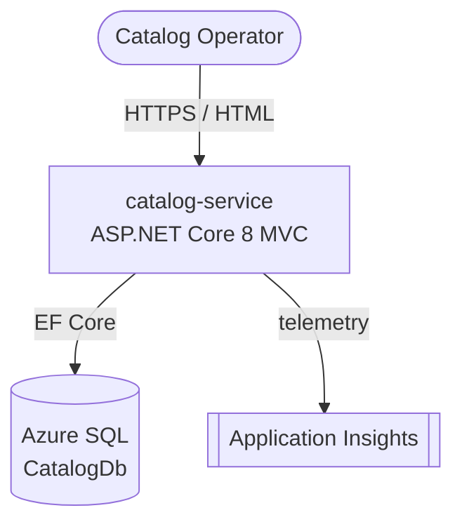
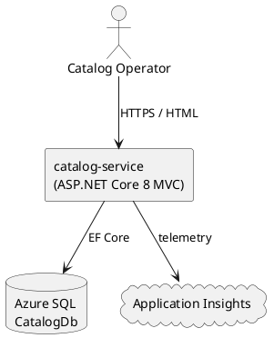
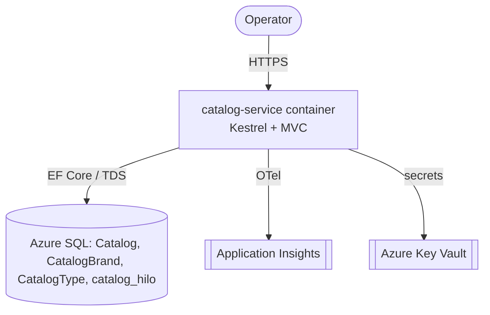
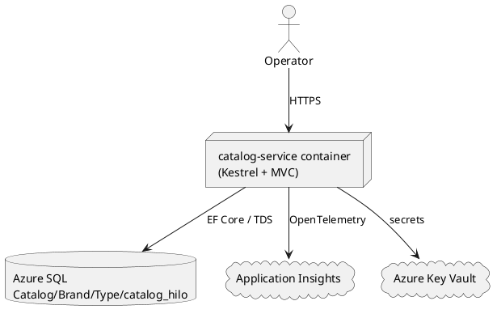
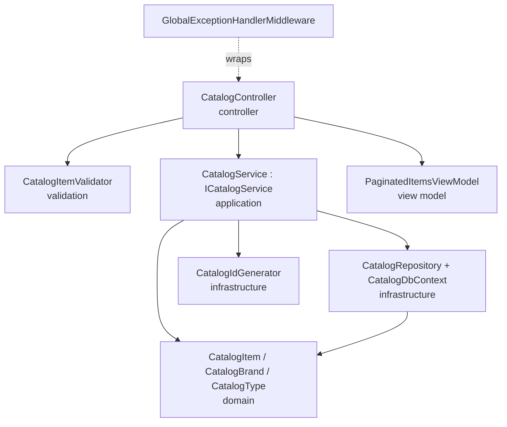
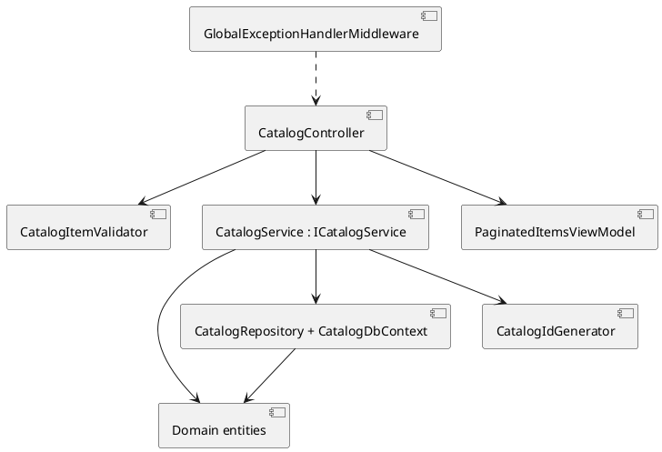
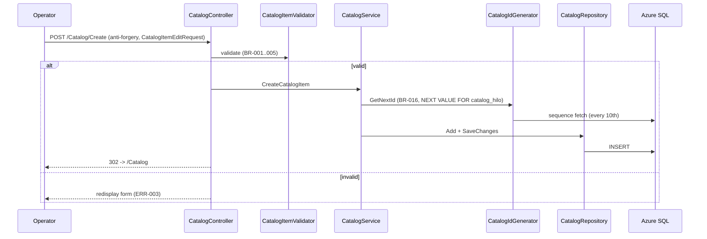
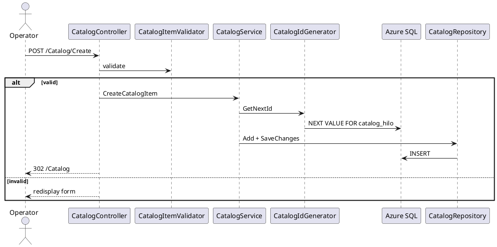
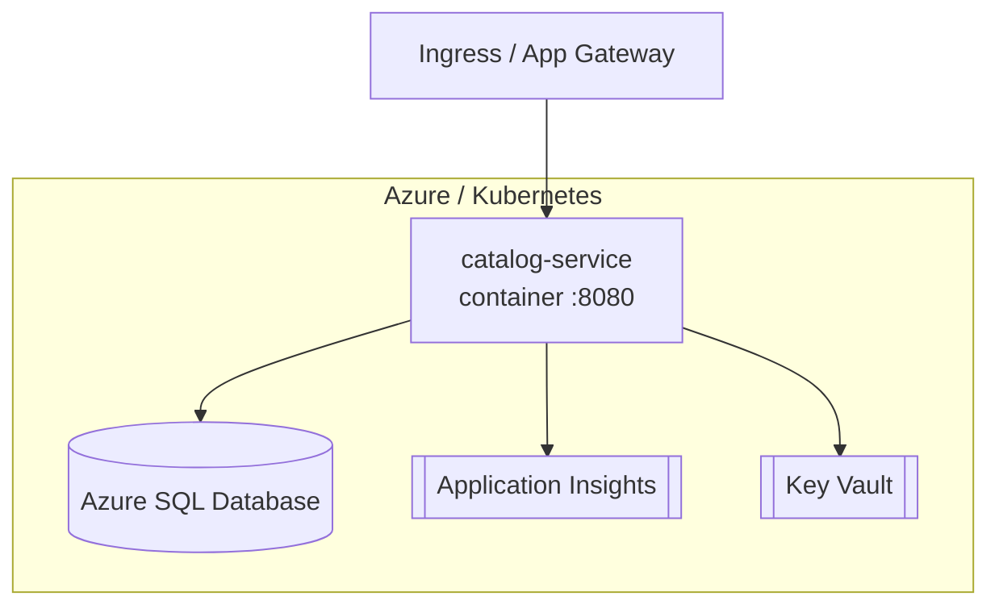
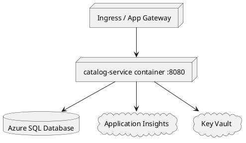

# Architecture Diagrams (C4) — Catalog Item Management (catalog-service)

Only elements present in `blueprint.json` are shown.

## 1. C4 Context

## 2. C4 Container

## 3. C4 Component — catalog-service internals

## 4. Data Flow — Create item (FLOW-003)

## 5. Deployment

