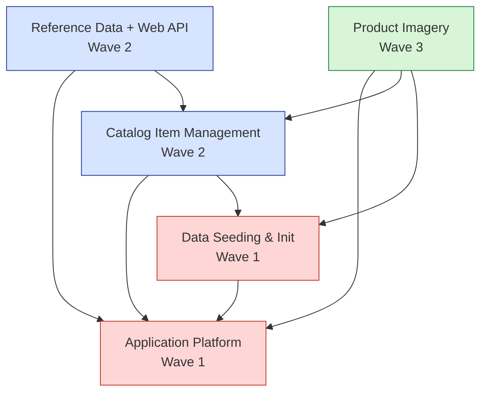
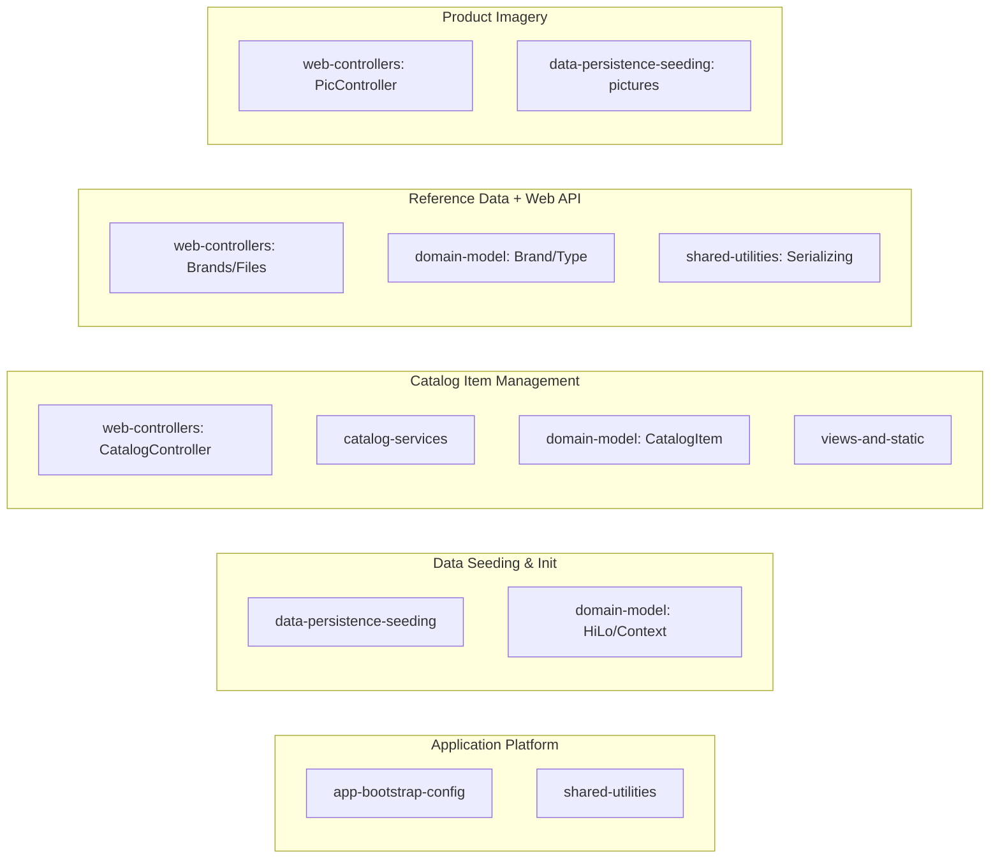

# Migration Dependency & Sequence Diagrams

Dependencies are evidence-based from per-feature "Depends On" analysis (the automated
edge detector returned 0 because features share modules). Arrows point from a feature to
the feature it **depends on** (must migrate first).

## 1. Feature Dependency Graph (color-coded by wave)

> Wave 1 = enablers (red), Wave 2 = core (blue), Wave 3 = imagery (green).

## 2. Migration Timeline (waves & parallelism)

```mermaid
gantt
    title eShopLegacyMVC Migration Waves
    dateFormat  X
    axisFormat %s
    section Phase 0
    Foundation (host, CI/CD, tests, storage)   :p0, 0, 3
    section Wave 1 (enablers)
    Application Platform        :w1a, after p0, 3
    Data Seeding & Init         :w1b, after p0, 3
    section Wave 2 (core)
    Catalog Item Management     :w2a, after w1a, 3
    Reference Data + Web API    :w2b, after w2a, 2
    section Wave 3 (imagery)
    Product Imagery             :w3a, after w2a, 2
    section Decommission
    Cutover & legacy shutdown   :dc, after w2b, 2
```

## 3. Feature → Module Mapping

