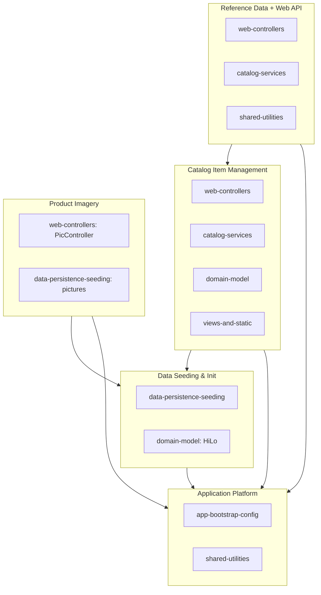

# Feature Map — eShopLegacyMVC

The app is a single bounded context (**Catalog Management**). It decomposes into 5
business features. The automated extractor misfired on this small codebase, so features
were derived manually from the discovery module docs.

| Feature | Business capability | Constituent modules |
| ------- | ------------------- | ------------------- |
| Catalog Item Management | CRUD admin UI for products (browse/create/edit/delete, paging, validation) | web-controllers, catalog-services, domain-model, views-and-static |
| Reference Data (Brands & Types) + Web API | Read brands/types; expose via `api/Brands`, `api/Files`; UI dropdowns | web-controllers, catalog-services, domain-model, shared-utilities |
| Product Imagery | Serve item pictures over HTTP; import picture sets on seed | web-controllers, data-persistence-seeding |
| Catalog Data Seeding & Initialization | Create DB, run sequences, seed from hardcoded/CSV/ZIP | data-persistence-seeding, domain-model |
| Application Platform (cross-cutting) | Hosting, DI, routing, config, logging, telemetry | app-bootstrap-config, shared-utilities |

Reference target: **eShopPorted** (in-repo ASP.NET Core + EF Core port of this context).

