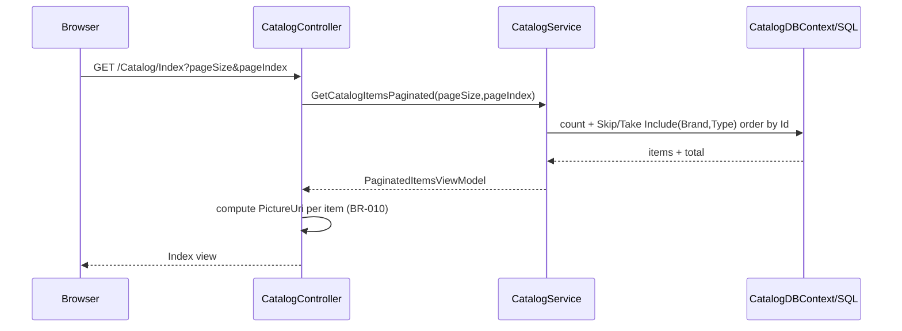
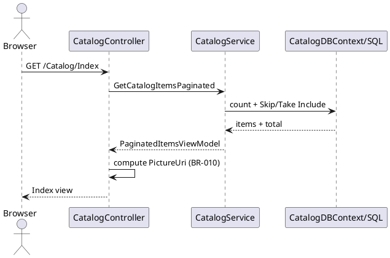
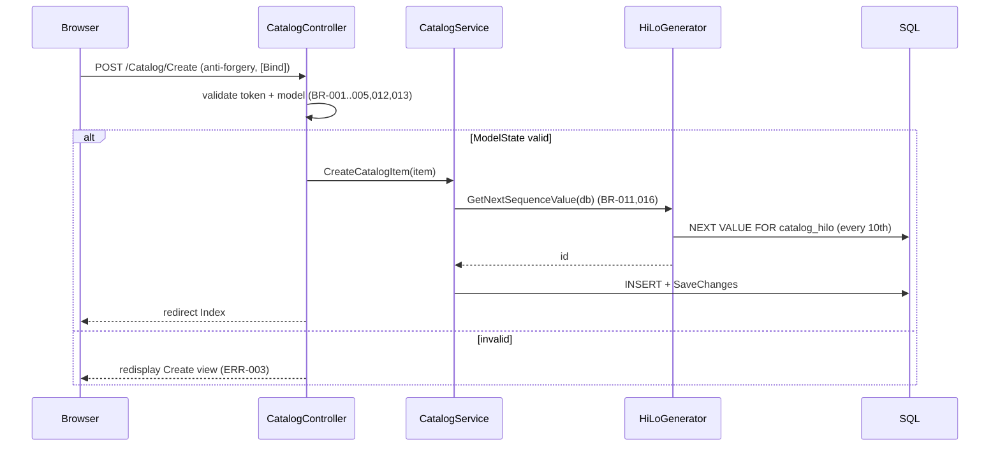
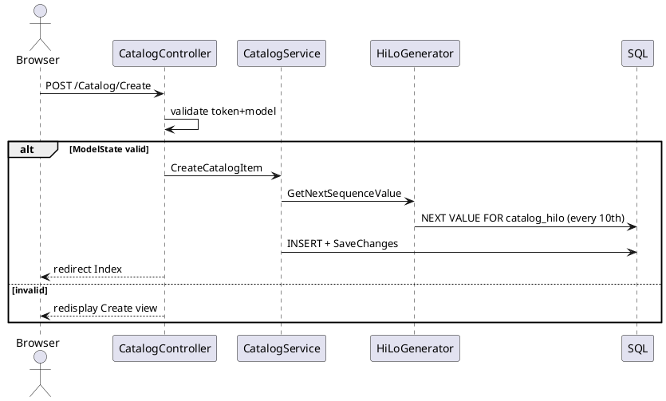
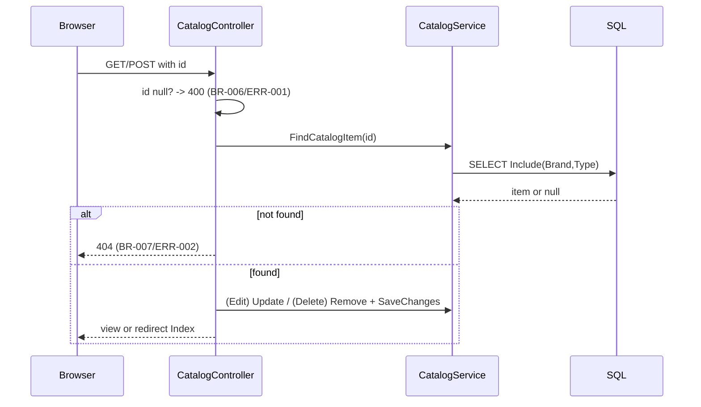
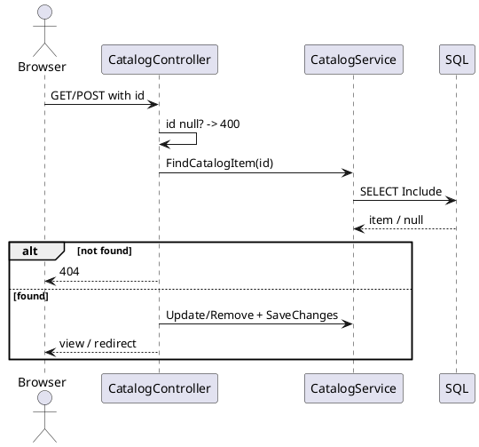
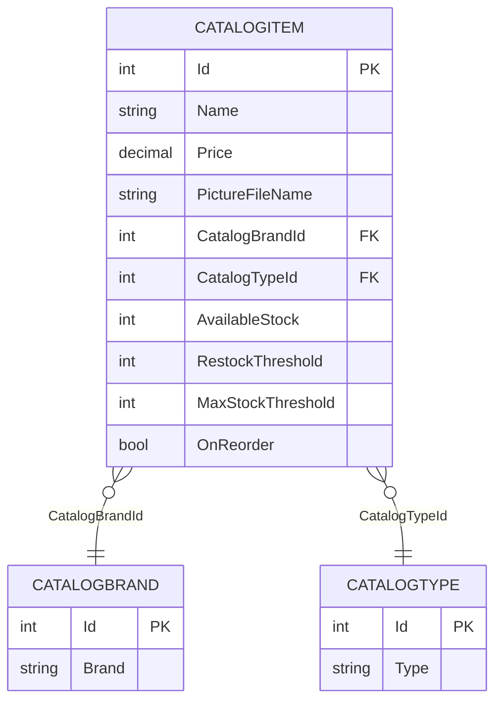
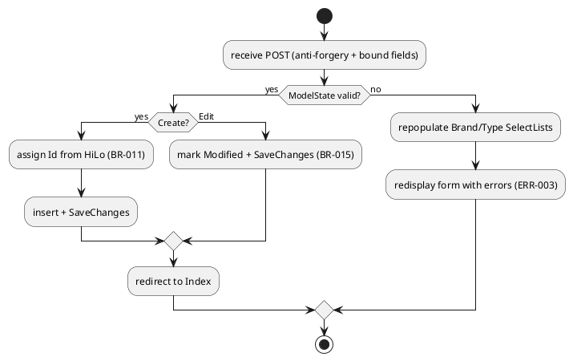

# Decomposition Diagrams — Catalog Item Management

All diagrams trace to `spec.json` / `flows.json` / `data-model.json`.

## 1. Sequence — FLOW-001 Browse catalog (paginated listing)





## 2. Sequence — FLOW-003 Create catalog item





## 3. Sequence — FLOW-002 / 004 / 005 (Details, Edit, Delete by id)





## 4. Entity Relationship Diagram



```plantuml
@startuml
entity CatalogItem {
  * Id : int <<PK>>
  Name : string
  Price : decimal
  PictureFileName : string
  CatalogBrandId : int <<FK>>
  CatalogTypeId : int <<FK>>
  AvailableStock : int
  RestockThreshold : int
  MaxStockThreshold : int
  OnReorder : bool
}
entity CatalogBrand { * Id : int <<PK>> \n Brand : string }
entity CatalogType { * Id : int <<PK>> \n Type : string }
CatalogBrand ||--o{ CatalogItem
CatalogType ||--o{ CatalogItem
@enduml
```

## 5. Activity — Create/Edit validation branching (BR-013)



> No standalone state-machine diagram: the feature has create/update/delete lifecycle
> transitions (BR-011, BR-015, BR-017) but no multi-state status field to model.
