# eShopLegacyMVC — Architecture Diagrams

Diagrams use only evidenced interactions from the source. Each has both a Mermaid and a
PlantUML block.

## 1. System Context

The eShopLegacyMVC web app as a single box with its external actors and systems.

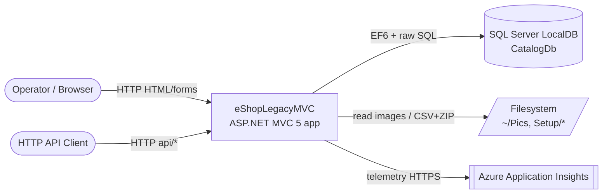

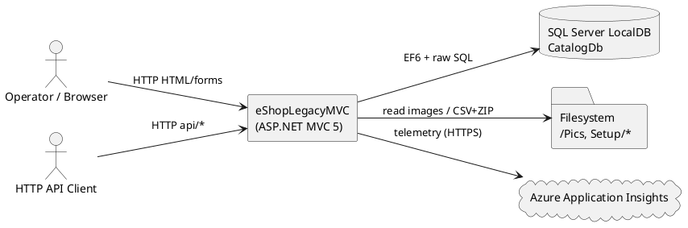

## 2. Service / Component Interactions

Internal components and the calls between them (protocol/mechanism labelled).

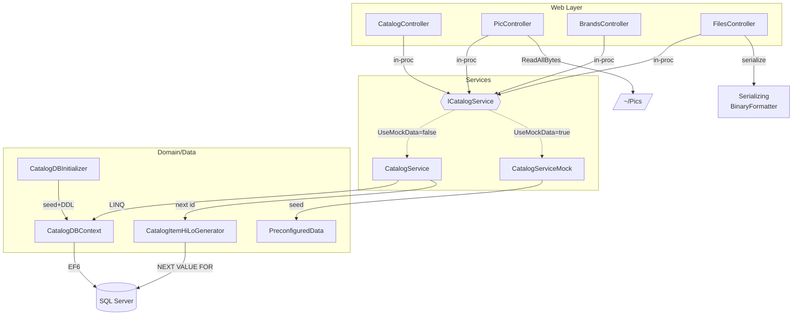

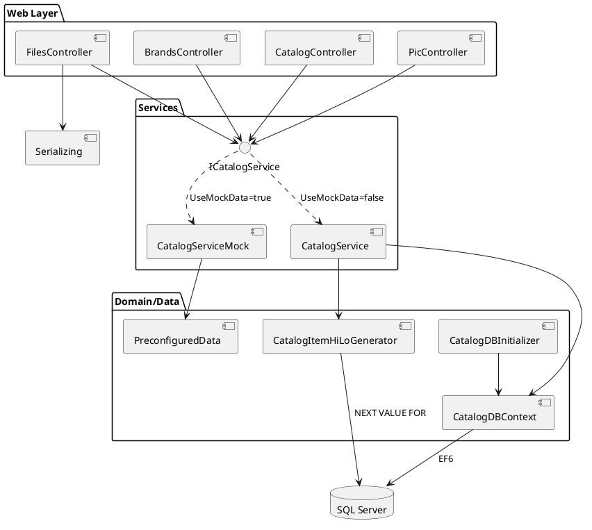

## 3. Main Request Flows

### 3a. Browse catalog (`GET /Catalog/Index`)

```mermaid
sequenceDiagram
    participant B as Browser
    participant C as CatalogController
    participant S as CatalogService
    participant X as CatalogDBContext
    participant D as SQL Server
    B->>C: GET /Catalog/Index?pageSize&pageIndex
    C->>S: GetCatalogItemsPaginated(size,index)
    S->>X: LINQ (Include Brand,Type; Skip/Take)
    X->>D: SELECT ... ORDER BY Id
    D-->>X: rows
    X-->>S: List<CatalogItem>
    S-->>C: PaginatedItemsViewModel
    C->>C: AddUriPlaceHolder (compute PictureUri)
    C-->>B: View(paginated)
```

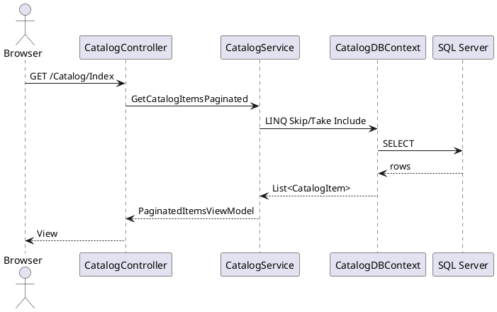

### 3b. Create item (`POST /Catalog/Create`)

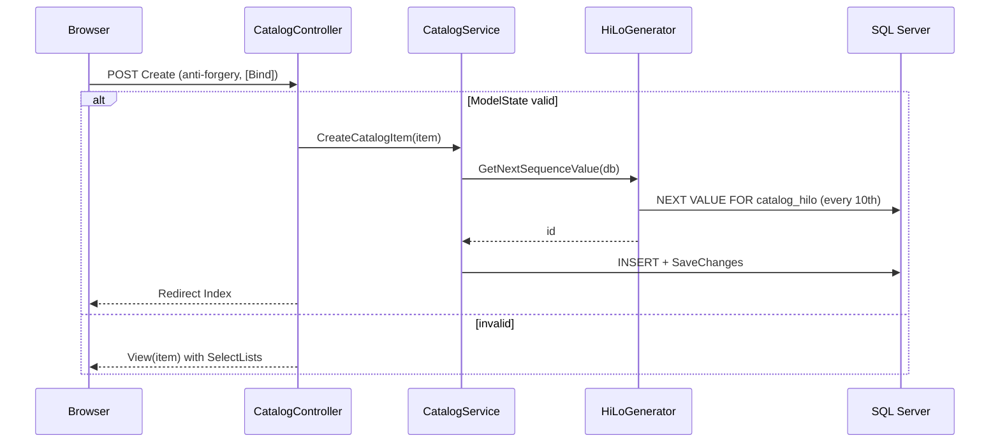

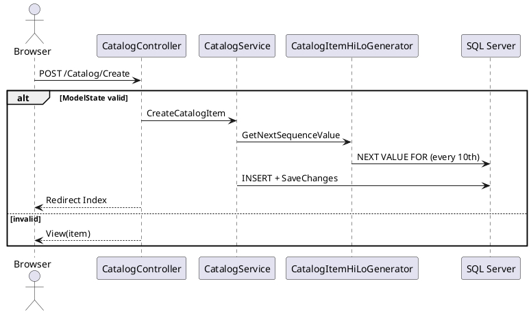

### 3c. Serve picture (`GET /items/{id}/pic`)

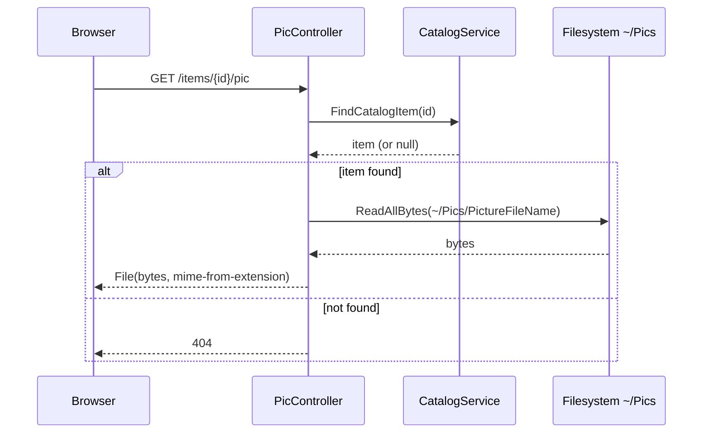

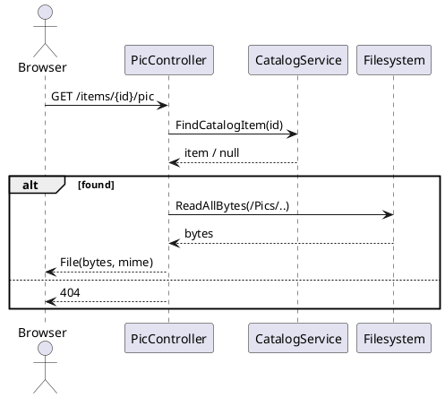

## 4. Data Flow (seed / startup)

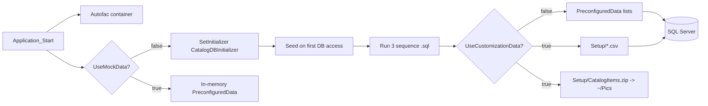

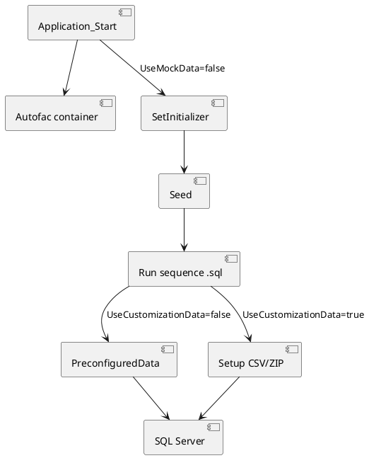
