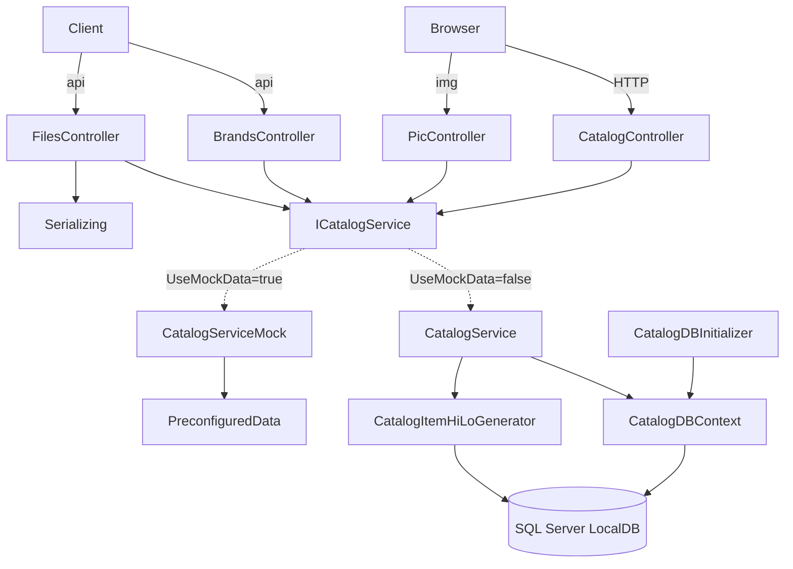

# eShopLegacyMVC — Migration Overview

## System Summary

eShopLegacyMVC is the legacy reference application from Microsoft's **eShopModernizing**
sample. It is a single-bounded-context catalog management web app: it lets an operator
browse, create, edit, and delete catalog items (mugs, t-shirts, sheets, etc.), each
belonging to a brand and a type, with stock thresholds and a picture. It is a classic
"monolithic ASP.NET MVC 5 on .NET Framework" application — the canonical *before* state
for a lift-and-shift / re-platform modernization story.

The app is deployed as an IIS web application backed by SQL Server LocalDB. It uses
server-side Razor for the UI, a thin Web API surface, Autofac for dependency injection,
Entity Framework 6 (code-first) for persistence, log4net + Application Insights for
observability, and a HiLo key-generation scheme backed by SQL Server sequences. A
build/runtime switch (`UseMockData`) lets the entire data layer run in-memory with no
database, and a second switch (`UseCustomizationData`) seeds from CSV/ZIP files.

The solution also contains a parallel project, `eShopPorted`, which re-implements the
same functionality on ASP.NET Core 2.2 + EF Core — the *after* reference. Primary
discovery scope here is `eShopLegacyMVC`; `eShopPorted` and the shared
`eShopLegacy.Utilities` library are documented for completeness.

## Tech Stack

| Layer | Technology | Version | Notes |
| ----- | ---------- | ------- | ----- |
| Language | C# | 7.x | `Web.config:31-32` |
| Runtime | ASP.NET MVC 5 + Web API 2 on .NET Framework | 4.7.2 (compile) / 4.6.1 (httpRuntime) | System.Web, IIS-hosted |
| DI | Autofac (+ Mvc/WebApi integration) | 6.1 | `Web.config:55-57` |
| ORM | Entity Framework | 6.x | code-first, `System.Data.Entity` |
| Database | SQL Server LocalDB (MSSQLLocalDB) | — | conn `CatalogDBContext` |
| Logging | log4net | — | per-request context providers |
| Telemetry | Azure Application Insights | — | `ApplicationInsights.config` + HTTP modules |
| Build | MSBuild (`.csproj` + `packages.config`) | — | NuGet classic restore |

## Codebase Statistics

| Metric | Value |
| ------ | ----- |
| Total source files (solution, graph) | 121 |
| C# files (eShopLegacyMVC primary) | ~22 |
| C# LOC (eShopLegacyMVC primary) | ~1,500 |
| Modules documented | 7 (+1 variant) |
| Shared libraries | 1 (`eShopLegacy.Utilities`) |
| External interfaces | DB (SQL Server), filesystem (`~/Pics`, `Setup/`), HTTP, App Insights |
| Test files | 0 |

## Entry Points

| Entry Point | Type | Trigger | Description |
| ----------- | ---- | ------- | ----------- |
| `MvcApplication.Application_Start` | bootstrap | app start | builds DI container, routes, EF initializer (`Global.asax.cs:27`) |
| `CatalogController.*` | online | HTTP `Catalog/{action}/{id}` | catalog CRUD UI (`Controllers/CatalogController.cs`) |
| `PicController.Index` | online | HTTP `items/{id}/pic` | serves item image bytes (`Controllers/PicController.cs:25`) |
| `BrandsController` | service | HTTP `api/Brands[/id]` | brand read + no-op delete |
| `FilesController.Get` | service | HTTP `api/Files` | BinaryFormatter brand stream |
| `CatalogController2.Index` | service | HTTP `api` | static stub ("Hello World!") |
| `CatalogDBInitializer.Seed` | batch | first DB access | creates + seeds DB (`Models/Infrastructure/CatalogDBInitializer.cs:32`) |

## Module Map

| Module | Files | Responsibility | Complexity |
| ------ | ----- | -------------- | ---------- |
| web-controllers | 5 | HTTP entry, UI + API | moderate |
| catalog-services | 3 | business logic (EF + mock) | simple |
| domain-model | 6 | entities, DbContext, HiLo, paging | simple |
| data-persistence-seeding | 9 | DB create + seed (hardcoded/CSV/ZIP) | complex |
| app-bootstrap-config | 7 | DI, routing, config, lifecycle | moderate |
| views-and-static | ~20 | Razor views + vendored JS/CSS | simple |
| shared-utilities | 2 | BinaryFormatter helper | simple (high migration risk) |
| eshopported-variant | ~20 | ASP.NET Core/EF Core port (reference) | moderate |

## External Interfaces

### Inbound

| Source | Protocol | Format | Frequency |
| ------ | -------- | ------ | --------- |
| Operator browser | HTTP | HTML/form | interactive |
| API clients | HTTP | JSON / binary | on demand |
| `Setup/*.csv`, `CatalogItems.zip` | File | CSV / ZIP | startup (when customization on) |

### Outbound

| Destination | Protocol | Format | Frequency |
| ----------- | -------- | ------ | --------- |
| SQL Server LocalDB | DB (EF6 + raw SQL) | relational | per request/seed |
| `~/Pics/*` | File | image bytes | read per image; wiped+written on customization seed |
| Azure Application Insights | HTTPS | telemetry | per request |

## Key Dependencies

## Risk Areas

| Area | Risk | Reason |
| ---- | ---- | ------ |
| `eShopLegacy.Utilities.Serializing` (BinaryFormatter) | high | obsolete/removed in modern .NET; insecure deserialization; breaks `api/Files` contract |
| `System.Web` / `Global.asax` / IIS modules | high | no equivalent in ASP.NET Core; full bootstrap rewrite required |
| `CatalogDBInitializer` (355 LOC) | medium | raw SQL sequences, filesystem side effects, `AppDomain.BaseDirectory` paths |
| EF6 → EF Core | medium | API/behavior differences (initializer vs migrations, `SqlQuery`) |
| `CatalogItemHiLoGenerator` singleton | medium | process-local cache; scale-out correctness depends on DB sequence |
| `PicController` filesystem reads | low-medium | unguarded `ReadAllBytes`; local `~/Pics` not cloud-friendly |

## Graph Navigation

The knowledge graph is at `.migration/discovery/graphify-out/graph.json`. Key facts:

- God nodes: `CatalogDBInitializer` (19 edges), `CatalogController` (14), `CatalogService` / `CatalogServiceMock` (13 each), `ICatalogService`.
- 66 communities (most are vendored JS libs — jQuery/bootstrap/popper); C# domain lives in communities 9, 23–28, 32–38.
- See `.migration/discovery/graphify-out/GRAPH_REPORT.md` for the full analysis.
- Built AST-only (no LLM key present); semantic layer not generated.
