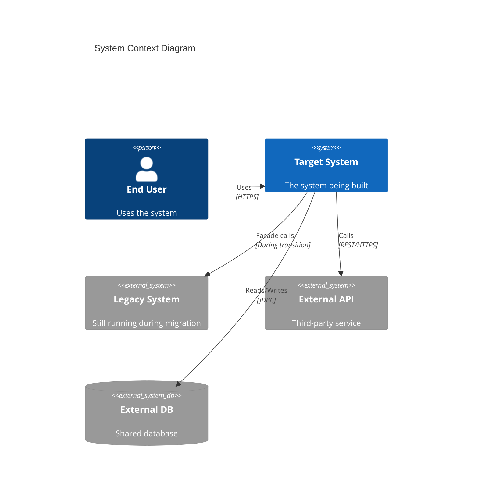
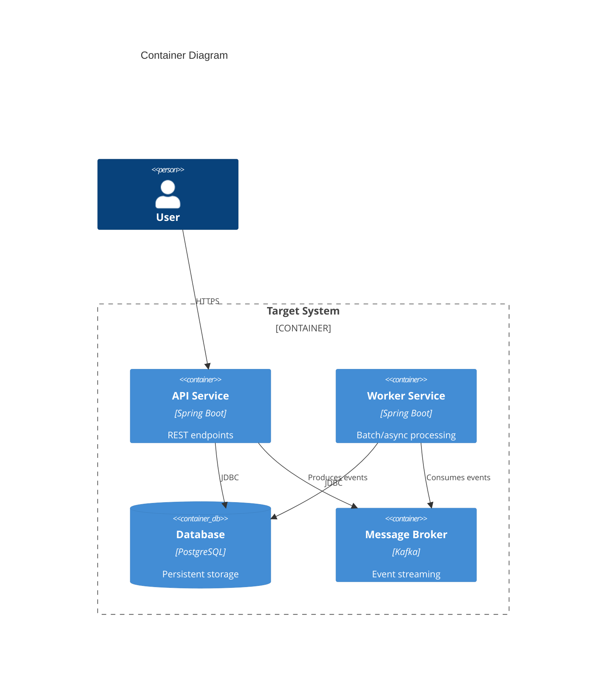
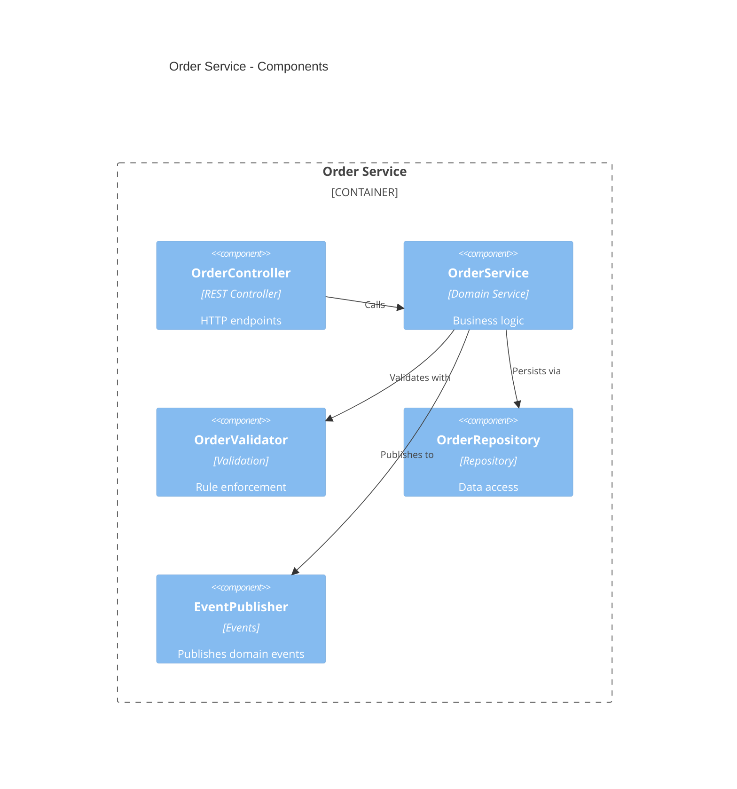

# C4 Architecture Model

## The Four Levels

| Level         | Shows                                        | Audience                    | When to Use                                   |
| ------------- | -------------------------------------------- | --------------------------- | --------------------------------------------- |
| **Context**   | System + external actors/systems             | Everyone (business + tech)  | Always — first diagram                        |
| **Container** | Services, databases, queues, their protocols | Architects + dev leads      | Always — shows deployment units               |
| **Component** | Internal layers within one container         | Developers of that service  | Per-service detail                            |
| **Code**      | Classes, interfaces, methods                 | Developers writing the code | Only if needed (usually overkill in diagrams) |

## When to Use Each

- **Context**: Always generate. Shows what the system does and who/what it interacts with.
- **Container**: Always generate. Shows the runtime units that get deployed.
- **Component**: Generate for each service that has 3+ internal layers or complex internal logic.
- **Code**: Skip — the scaffold.json and mapping.json serve this purpose better than diagrams.

## Mermaid C4 Syntax

### Context Diagram



### Container Diagram



### Component Diagram



## PlantUML C4 Syntax

### Context

```plantuml
@startuml
!include https://raw.githubusercontent.com/plantuml-stdlib/C4-PlantUML/master/C4_Context.puml

Person(user, "End User")
System(system, "Target System", "The system being built")
System_Ext(legacy, "Legacy System")
System_Ext(extapi, "External API")

Rel(user, system, "Uses", "HTTPS")
Rel(system, extapi, "Calls", "REST")
Rel(system, legacy, "Facade", "During transition")
@enduml
```

### Container

```plantuml
@startuml
!include https://raw.githubusercontent.com/plantuml-stdlib/C4-PlantUML/master/C4_Container.puml

Person(user, "User")
System_Boundary(sys, "Target System") {
    Container(api, "API Service", "Spring Boot", "REST endpoints")
    Container(worker, "Worker", "Spring Boot", "Async processing")
    ContainerDb(db, "Database", "PostgreSQL")
    ContainerQueue(queue, "Broker", "Kafka")
}

Rel(user, api, "HTTPS")
Rel(api, db, "JDBC")
Rel(api, queue, "Produces")
Rel(worker, queue, "Consumes")
@enduml
```

## Guidelines

- **Max 15 nodes** per diagram — split into sub-diagrams if larger
- **Label relationships** with protocol/technology (HTTPS, gRPC, JDBC, Kafka)
- **Color coding**: use default C4 colors (blue for internal, grey for external)
- **One description line** above each diagram explaining what it shows
- **Consistency**: entity names in diagrams must match blueprint.json service names exactly
- **External systems**: always show legacy system during migration (facade/adapter pattern)
- **Databases**: show as separate containers, not inside services
- **Queues/brokers**: show as explicit containers with protocol labels
