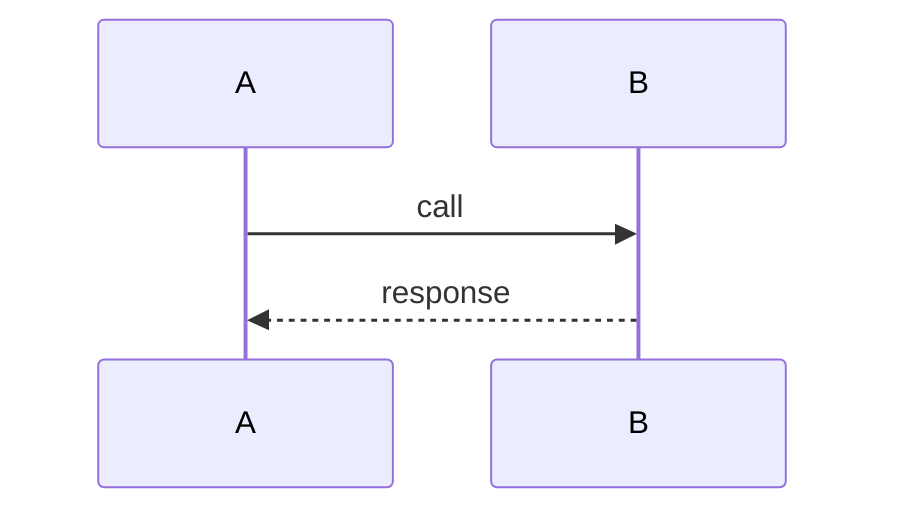
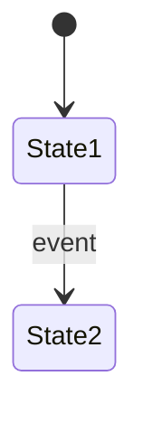
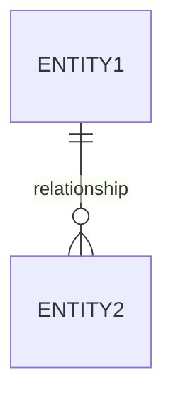
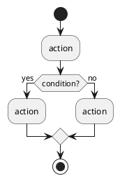

# Decompose Feature

You are a behavioral specification extractor. Given a feature selected for migration, you read every line of its source code and produce a complete, machine-readable specification that the transform step can use to generate equivalent code in the target platform.

## Supporting Files

- **References**: Extraction guidance
  - [references/extraction-patterns.md](references/extraction-patterns.md) — Language-specific patterns for identifying rules, flows, data models, and error handling
- **Templates**: Output structure
  - [templates/spec-schema.json](templates/spec-schema.json) — JSON schema defining the exact spec.json structure
  - [templates/summary.md](templates/summary.md) — Human-readable summary for user validation
- **Scripts**: Validation
  - `scripts/validate_spec.py` — Verify spec references valid file:line locations and internal consistency

## Step 1: Select Feature

Present the available features (from injected pipeline state) to the user.

Ask: "Which feature do you want to decompose for migration?"

If the user already specified the feature name, use that directly.

## Step 2: Load Context

Read the feature's assessment, all its module docs, graph neighborhood, and every source file listed in the module docs.

Read [references/extraction-patterns.md](references/extraction-patterns.md) for language-specific guidance on identifying rules.

### Parallel Extraction (5+ modules in feature)

If the feature has 5 or more modules, spawn **decomposer** agents in parallel — one per module:

```
For each module in the feature:
  Agent(decomposer):
    - Module name + source file paths
    - Feature context: what business capability this module contributes to
    - Module doc: .migration/discovery/modules/<module>.md
    - Graph neighborhood: what this module calls / is called by
    - Language: extraction-patterns.md guidance for the module's language
    - Output: partial JSON with rules, data structures, flow steps, errors, unknowns
```

Spawn up to 5 agents concurrently. Each agent extracts from its assigned module using a module-prefixed ID scheme (e.g., `BR-ORDPGM-001`) to avoid collisions. After all agents complete:

1. Merge all partial results into unified arrays
2. Renumber IDs sequentially (`BR-001`, `BR-002`, ...)
3. Resolve cross-module references (module A's flow calls module B's procedure)
4. Deduplicate shared data structures referenced by multiple modules

If the feature has fewer than 5 modules, proceed sequentially with Steps 3-6 below.

## Step 3: Extract Business Rules

Read every source file in the feature. For each business rule (conditional logic that makes a domain decision), extract:

```json
{
  "id": "BR-001",
  "description": "Plain English description of what this rule does",
  "type": "validation|calculation|state-transition|routing|transformation|authorization",
  "condition": "The condition expression (pseudocode or original syntax)",
  "action": "What happens when condition is true",
  "source": "path/to/file.ext:line-range",
  "confidence": "clear|inferred|ambiguous",
  "dependencies": ["BR-xxx"],
  "data_fields": ["entity.field_name"]
}
```

Rule types to look for:

- **validation**: input checks, constraint enforcement, range checks, null checks
- **calculation**: formulas, aggregations, derivations, rounding rules
- **state-transition**: status changes, workflow progression, lifecycle events
- **routing**: conditional branching, dispatch logic, feature flags
- **transformation**: data format conversion, field mapping, encoding/decoding
- **authorization**: permission checks, role-based access, ownership validation

**Extraction cues by language** (see references/extraction-patterns.md for full detail):

- COBOL: IF/EVALUATE, PERFORM with conditions, 88-level conditions
- PL/SQL: IF/CASE, WHERE clauses with business meaning, CHECK constraints
- C/C++: if/switch, assert, validation functions
- Java: if/switch, @Valid annotations, Stream filters with domain logic

Every rule MUST have a `source` field with exact `file:line` citation.

## Step 4: Extract Data Model

For each data structure used by the feature (tables, copybooks, structs, classes, DTOs):

```json
{
  "name": "STRUCTURE-NAME",
  "source": "path/to/definition:line-range",
  "fields": [
    {
      "name": "FIELD-NAME",
      "type": "original type (e.g., PIC 9(10), VARCHAR2(100), int32)",
      "target_type": "suggested target type (e.g., BIGINT, String, long)",
      "nullable": true/false,
      "constraints": ["PRIMARY KEY", "NOT NULL", "CHECK > 0"],
      "used_by_rules": ["BR-001", "BR-003"],
      "description": "what this field represents"
    }
  ],
  "relationships": [
    {"to": "OTHER-STRUCTURE", "type": "one-to-many|many-to-one|one-to-one", "foreign_key": "FIELD"}
  ]
}
```

Include type mapping suggestions (legacy type → target type) based on the migration strategy from the feature assessment.

## Step 5: Extract Sequence Flows

For each critical execution path through the feature (happy paths AND important alternative paths):

```json
{
  "id": "FLOW-001",
  "name": "Descriptive name (e.g., 'Order submission happy path')",
  "trigger": "What initiates this flow (API call, CICS transaction, batch step, event)",
  "steps": [
    {
      "seq": 1,
      "action": "What this step does",
      "source": "file:line-range",
      "calls": ["other modules/programs called"],
      "reads": ["data structures read"],
      "writes": ["data structures written"],
      "rules": ["BR-xxx business rules applied at this step"]
    }
  ],
  "error_paths": [
    {
      "at_step": 2,
      "condition": "what triggers the error path",
      "action": "what happens (rollback, error response, retry, etc.)",
      "source": "file:line-range"
    }
  ]
}
```

Trace each flow from entry point to exit. Include:

- The main happy path
- Each significant error/exception branch
- Retry/recovery paths if they exist

## Step 6: Extract Error Handling & Edge Cases

For each error/exception handling block:

```json
{
  "id": "ERR-001",
  "trigger": "What condition causes this error",
  "handling": "What the code does in response",
  "source": "file:line-range",
  "severity": "critical|warning|info",
  "recovery": "How the system recovers (or doesn't)",
  "user_impact": "What the end user sees/experiences"
}
```

Also capture edge cases:

- Boundary conditions (max values, empty inputs, overflow)
- Concurrency handling (locks, deadlock recovery)
- Timeout handling
- Null/missing data handling
- Character encoding issues

## Step 7: Derive Test Cases

From the extracted rules and flows, generate test cases that verify behavioral equivalence:

```json
{
  "id": "TC-001",
  "description": "What this test verifies in plain English",
  "covers_rules": ["BR-001"],
  "covers_flow": "FLOW-001",
  "input": {
    "entity": { "field": "value" }
  },
  "expected_output": {
    "result_field": "expected_value"
  },
  "type": "unit|integration|boundary|negative",
  "preconditions": "Any state that must exist before this test runs"
}
```

Generate test cases for:

- **Every business rule** — at least one positive and one negative test
- **Every flow** — happy path end-to-end
- **Boundary values** — min, max, zero, null, overflow for numeric rules
- **Error paths** — each ERR-xxx should have a test triggering it

Target: >= 80% of business rules covered by at least one test case.

## Step 8: Assemble spec.json

Combine all extractions into `.migration/decompose/<feature-name>/spec.json`:

```json
{
  "feature": "<feature-name>",
  "version": "1.0",
  "extracted_from": ".migration/assess/features/<feature-name>.md",
  "modules": ["list of all modules in this feature"],
  "migration_strategy": "from assessment (Rewrite/Refactor/etc.)",
  "target_platform": "from assessment",
  "business_rules": [...],
  "data_model": [...],
  "flows": [...],
  "errors": [...],
  "test_cases": [...],
  "external_interfaces": [
    {
      "type": "DB|API|MQ|File|Screen",
      "target": "name/endpoint",
      "protocol": "SQL|HTTP|MQ|FTP|CICS",
      "direction": "inbound|outbound|bidirectional",
      "source": "file:line"
    }
  ],
  "unknowns": [
    {
      "description": "what is unclear",
      "source": "file:line where the ambiguity exists",
      "impact": "what could go wrong if we guess incorrectly"
    }
  ]
}
```

Also write separate files for large sections:

- `test-cases.json` — just the test cases array
- `data-model.json` — just the data model array
- `flows.json` — just the flows array

### Step 8b: Generate Diagrams

Write `.migration/decompose/<feature-name>/diagrams.md` with embedded Mermaid AND PlantUML blocks:

**1. Sequence Diagram** — one per flow in `flows.json`. Shows participants (modules/programs/DB) and message flow:



**2. State Machine** — if the feature has business rules of type `state-transition`. Shows states and transitions:



**3. Entity Relationship Diagram** — from `data-model.json`. Shows data structures and relationships:



**4. Activity Diagram (PlantUML)** — for complex branching logic in business rules:



**Diagram rules:** max 15 nodes per diagram (split if larger), one-line description above each, both Mermaid and PlantUML, every diagram must trace to extracted data. Only include state machines if explicit state transitions exist in business rules.

## Step 9: User Validation

Present `summary.md` AND `diagrams.md` to the user.

The summary shows:

- Total counts: X business rules, Y flows, Z test cases, W data structures
- Business rules listed in plain English (grouped by type)
- Data structures with field counts
- Flows with step counts
- Unknowns/ambiguities requiring clarification
- Diagrams for visual confirmation

Ask:

1. "Does this completely capture what this feature does?"
2. "Are any business rules missing or incorrect?"
3. "Are there edge cases or error scenarios I missed?"
4. "Any corrections to the data model or flows?"

Incorporate all corrections. Update spec.json and regenerate affected diagrams.

## Step 10: Validate

Run the validation script:

```bash
python3 ${CLAUDE_SKILL_DIR}/scripts/validate_spec.py .migration/decompose/<feature-name>/
```

This checks:

- Every `source` field points to an existing file with valid line numbers
- Every `data_fields` reference in rules maps to a field in `data-model.json`
- Every `covers_rules` in test cases references a valid rule ID
- No orphan rules (rules without any test case)
- No orphan flows (flows without any test case)
- All `dependencies` between rules are valid references

If validation fails, fix the issues and re-run until clean.

## Rules

- Every extracted item MUST have a `source` field with exact `file:line` citation — no exceptions
- Never invent business rules that aren't in the code — if you infer something, mark confidence as "inferred"
- If logic is ambiguous, add it to `unknowns` rather than guessing
- Trust code over comments — extract actual behavior, not intended behavior
- Include dead code paths only if they contain business logic that might be intentionally disabled
- Preserve original identifiers (variable names, table names, field names) alongside descriptions
- The spec must be complete enough that someone could rewrite the feature from spec.json alone without reading the original source
